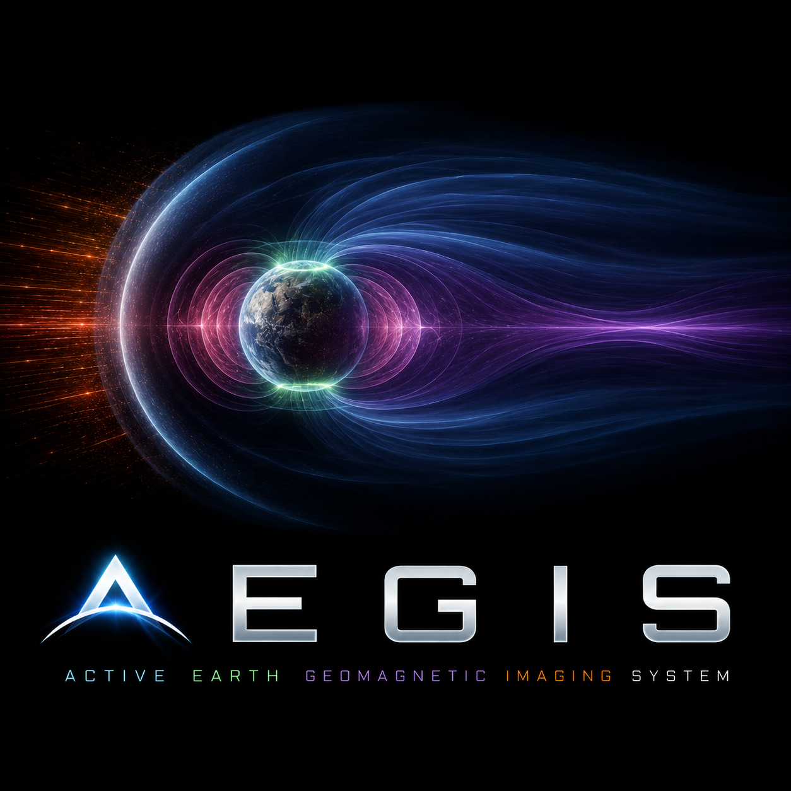

<p align="center">
  
</p>

<h1 align="center">AEGIS</h1>

<p align="center">
  <b>A</b>ctive <b>E</b>arth <b>G</b>eomagnetic <b>I</b>maging <b>S</b>ystem<br>
  <sub>A real-time, browser-based 3D visualization of Earth's magnetosphere, driven by live space-weather data from NOAA.</sub>
</p>

<p align="center">
  
  
  
  
</p>

---

AEGIS ray-marches the magnetosphere in a single WebGL2 fragment shader. The
magnetopause, bow shock, plasmasphere, ring current, magnetotail current sheet,
auroral ovals and substorm reconnection are all recomputed every frame from the
solar wind, IMF, Kp and GOES X-ray feeds that NOAA publishes right now. Nothing
is pre-baked — the shape you see is the shape of near-Earth space at the moment
you load the page.

**Demo:** https://aegis.sponde.de/

---

## What you're looking at

| Element | Meaning |
|---|---|
| Blue/white teardrop | The magnetosphere — Sun-compressed, drawn into a long night-side tail |
| Warm dayside dome | Bow shock + magnetosheath — shocked, heated, draped solar wind |
| Arcing strands ("jellyfish") | Geomagnetic field-line shells (McIlwain L = 2…6) — and they *flex with the drivers*: the dayside bell crushes inward under pressure, the inner shells balloon out as the ring current (Dst) deepens, and the tail draws out under southward Bz |
| Inner glow | Plasmasphere — cold dense plasma; shrinks inward during storms |
| Crimson glow hugging Earth (storms) | Partial ring current — noon-tight / midnight-bulged, frozen onto the closed field lines; the Dst signature of a main phase |
| Tail band | Plasma sheet (Harris current sheet), flapping in real time |
| Orange spot behind Earth | Near-Earth reconnection X-line (Bz southward) |
| Polar rings | Aurora ovals — the live NOAA OVATION nowcast; in storm replays, a model oval (Kp/Bz-driven teardrop: fat and deep on the night side, narrow on the day side) that expands equatorward ~30 min *after* the tail loads (substorm growth phase) |
| Terminator | Real day/night boundary for the current UTC time |

A full annotated walkthrough is in the manuals:
**[English](docs/README.md)** · **[Deutsch](docs/README.de.md)**.

---

## Quick start

AEGIS is a static site with **no build step** — plain HTML + ES modules + GLSL.
It does need to be served over HTTP (ES module imports and `fetch()` do not work
from `file://`), and it needs network access to reach the NOAA endpoints.

```bash
git clone https://github.com/Kracht/AEGIS.git aegis
cd aegis

# any static file server works; e.g. Python:
python3 -m http.server 8080

# then open http://localhost:8080
```

**Requirements**

- A browser with **WebGL2** (Chrome/Edge/Firefox/Safari, last few years).
- Internet access for the live NOAA feeds. Offline or if a feed fails, AEGIS
  falls back to quiet-condition defaults and shows a stale-data warning.

**Controls**

- `C` (or the **Cam: …** label by the FPS counter) toggles **free-look**: by
  default the camera flies a slow cinematic arc across the flank (the side-on
  angle where the storm deformation reads best, never diving down the tail); in
  free-look you **drag to orbit** Earth and **scroll to zoom** (4–45 Rₑ), so you
  can park on whichever 3/4 angle frames the compression and ring-current
  inflation. The view stays centered on Earth in both modes.
- `F2` (or the **Settings [F2]** label by the FPS counter) toggles the visual
  tuning panel — camera orbit/FOV, exposure, gamma, and per-layer intensity.
- `F3` (or the **Mode: …** label next to it) cycles the render mode:
  **Visual** (default volumetric scene) → **Structural** (SDF outlines of
  magnetopause, bow shock, L-shells on a black backdrop with a dimmed Earth)
  → **Data** (Visual underneath, with a panel of every live uniform — value,
  units, citation, and the scene feature each drives, including the L1 `lag`
  clock). The choice persists in localStorage.
- `F4` toggles the **causal HUD** — the two-branch graph of *why the scene
  changed*: a fast compression branch (`Pdyn → r₀`) and a slow storm branch
  (`Bz → reconnection → injection → Dst`), drawn as separate tracks because
  they are independent mechanisms. Nodes light from the live values, edges
  carry the real propagation delays (the L1 advection clock, the ring-current
  decay time τ), and hovering a node reveals its governing equation, current
  value, and citation.
- The **transport bar** along the bottom replays curated instrument-era storms.
  Pick **Live** (NOAA realtime) or a curated event — **November 2004**,
  **St. Patrick's 2015**, **Gannon 2024**, **January 2026**, or a
  **high-speed stream** — then
  play / pause / scrub and set the time-acceleration. Selecting a storm reveals
  the causal HUD automatically; that's where the lag clocks and the branch
  independence become legible (you can't watch a 7-hour Dst recovery in real
  time). The high-speed stream is the teaching contrast: it compresses r₀
  almost as hard as the November superstorm, yet drives only a tenth of the
  Dst — compression and storm are *not* the same thing. During a replay the
  status panel shows the **measured SYM-H** beside the modeled Dst, so you can
  watch the estimate track (or miss) the real ring current. The propagation
  delays are always on view there too — `L1 → bow shock` and the further
  `aurora` growth-phase lag.

---

## How it works

```
NOAA SWPC / GOES / OVATION  ──▶  data-fetcher.js   ──▶  Shue (1997) r₀, α
                                  aurora-texture.js ──▶  polar aurora grids
                                          │
                                          ▼
                            renderer.js  (uniforms, textures)
                                          │
                                          ▼
              fragment.glsl  —  one full-screen triangle,
              volumetric ray march of the whole scene
```

1. `magnetosphere-model.js` is the physics core: given a raw solar-wind sample
   and a clock, it derives the Shue et al. (1997) magnetopause standoff `r₀`
   and flaring exponent `α` plus the solar-wind dynamic pressure, and integrates
   the Burton/O'Brien (2000) ring-current equation for a live Dst estimate. It
   buffers each snapshot into a 90-min history ring and reports the L1-advected
   quantities at `now − 1.5×10⁶ km / v_sw` (~55 min @ 450 km/s, ~31 min @ 800
   km/s), so the scene shows what the magnetosphere is seeing *now* — not what
   the L1 probe just observed. The Dst ODE is closed over the same lag, and a
   τ≈5 min low-pass eases Kp's 3-hourly bin steps. The model is **time-agnostic**
   (no wallclock inside): `data-fetcher.js` drives it with `Date.now()` from the
   live NOAA feed, while `timeline-source.js` drives the *same* model with a
   scrub clock from a curated storm — so replay obeys identical physics, and the
   causal sequencing emerges rather than being keyframed. Both sit behind
   `data-source.js` and are interchangeable through `createDataSource(id)`.
2. `aurora-texture.js` polls the NOAA OVATION aurora nowcast into two polar
   `R8` textures. These drive the oval in **live** mode; in **replay** (no
   historical OVATION exists) the shader synthesises the oval from the model
   state — a Gussenhoven (1983) equatorward boundary (~2°/Kp) shaped into a
   teardrop, fed by a Bz delayed an extra ~30 min beyond the L1 lag so the oval
   expands *after* the tail loads (the substorm growth phase).
3. `renderer.js` compiles the program and pushes per-frame uniforms; the only
   geometry is a single oversized triangle.
4. `fragment.glsl` ray-marches emission/extinction through an SDF model of the
   magnetosphere (96 jittered steps, Reinhard tone map). The field-line shells
   are not a frozen shape: their deforming warp is driven by the live state the
   way an empirical field model (Tsyganenko) parametrises its analytic
   deformation — dynamic pressure (via `r₀`) pinches the dayside, southward
   `Bz` stretches the tail, and the integrated `Dst` inflates the inner closed
   shells. Because `Dst` is the lagged, decaying ODE output, the fast pressure
   compression and the slow ring-current inflation visibly separate in time.

---

## Data sources

All live data is fetched client-side from **NOAA's Space Weather Prediction
Center (SWPC)** — U.S. Government work, public domain.

| Feed | Endpoint | Used for |
|---|---|---|
| Solar wind magnetic field | `services.swpc.noaa.gov/products/solar-wind/mag-2-hour.json` | Bz, Bt |
| Solar wind plasma | `services.swpc.noaa.gov/products/solar-wind/plasma-2-hour.json` | speed, density, pressure |
| Planetary K-index | `services.swpc.noaa.gov/products/noaa-planetary-k-index.json` | Kp, G-storm scale |
| GOES X-ray flux | `services.swpc.noaa.gov/json/goes/primary/xrays-1-day.json` | flare class |
| OVATION aurora | `services.swpc.noaa.gov/json/ovation_aurora_latest.json` | auroral ovals |

Most measurements originate from **DSCOVR** at the L1 Lagrange point and the
**GOES** satellites.

The curated-storm replays use **real instrument-era data** from NASA's
**[OMNI](https://omniweb.gsfc.nasa.gov/)** dataset (IMF + plasma time-shifted to
the bow-shock nose, 5-min cadence, plus hourly planetary Kp), fetched once via
the CDAWeb REST service and bundled as compact JSON under `data/scenarios/`
(regenerate with `tools/build-scenarios.mjs`). Halloween 2003 is conspicuously
absent: OMNI's upstream monitors were saturated during that superstorm, so a
faithful *driver-driven* replay is impossible — the same "real data only" rule
that rules out Carrington 1859. November 2004 (fully covered, comparably deep)
stands in.

---

## Project structure

```
index.html            # entry; canvas + status panel mount points
src/
  main.js             # boot + render loop + orbital (terminator) maths
  renderer.js         # WebGL2 program, textures, per-frame uniforms
  data-source.js      # data-source seam + createDataSource(id) factory
  magnetosphere-model.js # time-agnostic physics core (Shue, Dst ODE, L1 lag)
  data-fetcher.js     # live NOAA SWPC ingestion — wallclock driver of the model
  timeline-source.js  # curated-storm replay — scrub-clock driver of the model
  scenarios.js        # curated-storm manifest (shared by source + transport)
  aurora-texture.js   # OVATION nowcast → polar GL textures
  ui.js               # live status HUD (incl. modeled Dst) + EN/DE manual links
  dev-panel.js        # FPS readout + Settings [F2] tuning panel
  render-mode.js      # Visual/Structural/Data mode controller (F3)
  causal-hud.js       # two-branch causal graph overlay (F4)
  camera.js           # auto cinematic orbit ↔ free-look (drag/zoom) controller (C)
  transport.js        # scenario picker + scrub/play/speed bar
shaders/
  vertex.glsl         # full-screen triangle
  fragment.glsl       # the entire scene (ray-marched volumetrics)
textures/             # NASA Blue Marble (monthly) + Black Marble night
data/scenarios/       # bundled real OMNI storm series (replay)
tools/build-scenarios.mjs # offline regenerator for data/scenarios/ (NASA CDAWeb)
docs/                 # user manuals (EN / DE)
```

---

## Acknowledgements & references

This project stands on published space-physics models, public NASA/NOAA data,
and well-known real-time graphics techniques.

**Space-physics & empirical models**

- Shue, J.-H., *et al.* (1997). *A new functional form to study the solar wind
  control of the magnetopause size and shape.* J. Geophys. Res., 102(A5),
  9497–9511. — magnetopause shape.
- Fairfield, D. H. (1971). *Average and unusual locations of the Earth's
  magnetopause and bow shock.* J. Geophys. Res., 76(28), 6700–6716.
- Cairns, I. H., *et al.* (1995). — bow-shock standoff scaling.
- Harris, E. G. (1962). *On a plasma sheath separating regions of oppositely
  directed magnetic field.* Nuovo Cimento, 23, 115–121. — tail current sheet.
- Tsyganenko, N. A. (1995, 2002). *Modeling the Earth's magnetospheric magnetic
  field…* J. Geophys. Res. — the empirical, driver-parametrised field
  deformation (Pdyn, Dst, IMF) that the field-line warp emulates qualitatively.
- Carpenter, D. L., & Anderson, R. R. (1992). *An ISEE/whistler model of
  equatorial electron density in the magnetosphere.* J. Geophys. Res., 97(A2),
  1097–1108. — plasmapause.
- Burton, R. K., McPherron, R. L., & Russell, C. T. (1975). *An empirical
  relationship between interplanetary conditions and Dst.* J. Geophys. Res.,
  80(31), 4204–4214. — ring-current / Dst equation.
- O'Brien, T. P., & McPherron, R. L. (2000). *An empirical phase space analysis
  of ring current dynamics.* J. Geophys. Res., 105(A4), 7707–7719. — the
  injection / decay parameterisation used for the live Dst estimate.
- Newell, P. T., *et al.* (2009). — OVATION auroral precipitation model
  (delivered operationally as NOAA SWPC's OVATION aurora nowcast).
- Gussenhoven, M. S., Hardy, D. A., & Heinemann, N. (1983). *Systematics of the
  equatorward diffuse auroral boundary.* J. Geophys. Res., 88(A7), 5692–5708. —
  the ~2°/Kp equatorward-boundary relation used for the replay aurora oval.
- Cooper, P. I. (1969). — solar declination equation, used to place the
  day/night terminator.
- Reinhard, E., *et al.* (2002). *Photographic Tone Reproduction for Digital
  Images.* — the `c/(1+c)` tone-mapping operator.

**Real-time graphics techniques**

- Inigo Quilez — articles on raymarching distance fields, value noise / fBm,
  and domain warping ([iquilezles.org](https://iquilezles.org/articles/)).
  The SDF scene model and turbulence are built on these techniques.
- The classic GLSL `fract(sin(dot(...)) * 43758.5453)` hash, and the
  sine-free variants surveyed in Dave Hoskins, *"Hash without Sine"*
  (Shadertoy).
- The single full-screen-triangle trick for shader-only rendering.

**Data & imagery**

- **NOAA Space Weather Prediction Center** — live space-weather data
  (DSCOVR @ L1, GOES, OVATION). Public domain.
- **NASA Visible Earth** — *Blue Marble Next Generation* (monthly) and
  *Black Marble / Earth at Night* surface imagery. Credit: NASA Earth
  Observatory; used with attribution.
- **NASA/GSFC Space Physics Data Facility — OMNI** (King, J. H., &
  Papitashvili, N. E.). High-resolution (5-min) and hourly OMNI data, accessed
  via CDAWeb. [doi:10.48322/hkaw-ff03](https://doi.org/10.48322/hkaw-ff03).
  Public domain — the curated-storm replays.

Any errors in the physical interpretation are mine, not the cited authors'.

---

## Disclaimer

AEGIS is an **illustrative, schematic** visualization for education and
outreach. It blends empirical models with artistic interpolation and is **not a
forecasting or operational tool**. The on-screen Dst is a *modeled estimate*
from the Burton/O'Brien coupling, not the official Kyoto Dst index. For
authoritative space-weather information see
[NOAA SWPC](https://www.swpc.noaa.gov).

---

## License

[MIT](LICENSE) © 2026 skracht. Third-party data/imagery (NOAA, NASA) retain
their own terms — see the [LICENSE](LICENSE) notice.
